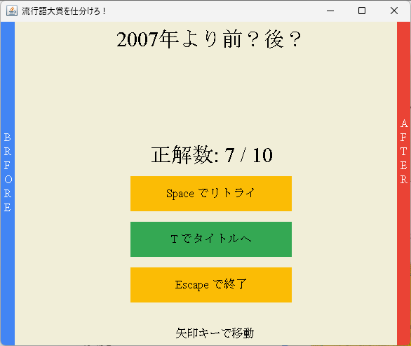

# 1. アプリケーションの説明

## 「流行語を仕分けろ！」ゲーム

カードに書かれた流行語大賞が，指定された年代よりも大きいか小さいかを考え，左右に仕分けるゲーム．

## 各画面の概要と操作方法

### **タイトル画面**

- スペースキーでスタート
- エスケープキーでゲーム終了
- BGMが流れ始める

### **ゲーム画面**

- 上部に書いてあるお題に従って流行語大賞カードを仕分ける
- 左右の矢印キーで，「前」(BEFORE)と「後」(AFTER)に仕分ける
- 正解の場合は「ピンポン」，不正解の場合は「ブッブー」という効果音が鳴る
- すべてのカードを仕分け終わったら終了

### **リザルト画面**

- 正解数が表示される
- スペースキーでリトライ
- Tキーでタイトル画面へ
- エスケープキーでゲーム終了
- 表示時に効果音が鳴る

## 2. クラス図とシーケンス図

**クラス図**

クラス図は上図の通りである．基本的な機能はすべてAwardCardPanelクラスに集約されており，それを実行するAppクラスとJSONファイルを操作するためのOperateJSONクラスで構成されている．特筆すべきこととしては，外部ライブラリであるjacksonとjacoの二つである．jacksonはJSONファイルを扱うためのクラスであり，jacoは音楽ファイル(mp3)を扱うためのクラスで，どちらもjarファイルをダウンロードして使用している．j

**シーケンス図**

シーケンス図は上図の通りである．AppクラスのmainメソッドにてAwardCardPanelクラスを作り，そのクラスがさらにbgmを流したり，スレッドを立てて非同期処理を行っている．スレッド内では流行語大賞カードの動きを扱うmoveメソッドと再描画を行うrepaintメソッドを行った後に，sleepメソッドにて一時的に処理を止める処理を繰り返している(上図loop部分)．このloop部分はゲーム終了までずっと実行される．

なおmoveメソッドやrepainメソッドはユーザのキーボード入力を受けて様々な動作を行うが，シーケンス図への記入方法が調べてもわからなかったため記載を省略している．

## 3. ソースコードの解説

**Appクラス**

AppクラスはmainメソッドにてJFrameを作成し，パネルとしてAwardCardPanelクラスをインスタンスしてaddにて加えている．

**OperateJSONクラス**

OperateJSONクラスは１つのメソッドを持っており，そのBestAwardメソッドではdataフォルダに入っている各年の流行語大賞のデータを取り出して，文字列に変換してArrayList `<String>`型として返している．この配列には，年，賞名，流行語，受賞者，説明が含まれている．JSONファイルを扱うために，外部ライブラリであるjacksonのJsonNodeとObjectMapperを使用している．

**AwardCardPanelクラス**

AwardCardPanelクラスはこのゲームの肝であり，その大部分の機能が集中している．最初のフィールドでは各種定数がstatic finalとして宣言されているものがある．これらの変数は重要な値であり，変更されないようにしている．

シーケンス図で述べた通り，スレッドを立ててその中ではmoveメソッドとrepaintメソッドを繰り返し実行している．moveメソッドではカードの移動を行っており，repaintメソッドではその再描画を行っている．

ゲームの状態はgameState変数にて管理しており，これが0のときはタイトル画面，1のときはゲーム画面となっている．タイトル画面の描画はpaintTitleメソッド，ゲーム画面はpaintGameメソッドにて行っている．

加えてキー入力もKeyListenerクラスを継承したMyKeyListenerクラスにて受け取っている．スペースキーや左右の矢印キーなどの入力を常に受け取っており，それに応じて描画の内容を変更している．

### 4. 必須要件と評価ポイント

**必須要件**

- 実行に必要なクラスとして，AppクラスとOperateJSONクラスとAwardCardPanelクラスの3つのクラスで構成されている
- 実行するとGUIウィンドウが表示される
- 機能するキーボード入力を含んでいる
- Applicationフォルダをカレントディレクトリにした状態で実行できる
- すべてのプログラムの先頭に指定された記載を行っている

**評価ポイント**

- 図形描画や画像を用いた表現がある
  - 本ゲームの表示はすべて図形描写にて行っている
- マルチスレッドを使用している
  - 図形描画を行うためにマルチスレッドを用いて常に再描画を行い，画面の更新を行っている
- 文字入出力（キーボードやファイル入力）
  - キーボードによる入力により，ユーザが操作できるようにしている
- ファイル入出力（セーブデータ、ロード 等）
  - 流行語大賞をJSONファイルとして保存し，それを操作してランダムで表示されるようにしている
  - mp3ファイルを操作して，BGMや効果音として再生している

### 5. 工夫した点・こだわりポイント

- 流行語大賞を実際にユーキャンのホームページからスクレイピングすることによって，自分の扱いやすいデータを作成した
  - Pythonでスクレイピングしたコードは"scraping.ipynb"．
- カードの描画をpaintCardメソッドにてまとめることで，一つの物体として扱いやすくしている．
- カードを左右に分けるというシステムは最近はやりのマッチングアプリをイメージしている．
  - 左右に分けるという方法はユーザにとって非常に扱いやすいと考えた．
- VSCodeにて”JAVA : Create Java Project”コマンドを実行し，Java開発に最適な環境を構築して行った
  - ゆえにフォルダ構造がきれいになっているが，若干環境依存の可能性がある

### 6. 実行環境について

本プログラムはVSCodeの”****Extension Pack for Java****”という拡張機能を利用し，”JAVA : Create Java Project”コマンドを実行して作られた環境にて作成している．

Javaのプログラム自体は特別なものではないため問題はないと思うが，もしも実行できなかった場合にはこの拡張機能をいれた状態で実行してみてほしい．

### 7. 参考文献

以下のサイトのコードをそのまま利用することはしていないが，参考にして自分で実装した．

また生成系AIについては使用していない．

[1] Jackson使い方メモ #Java , Qiita, [https://qiita.com/opengl-8080/items/b613b9b3bc5d796c840c](https://qiita.com/opengl-8080/items/b613b9b3bc5d796c840c), 2024/1/23 参照

[2] Java で mp3 を再生する, Delft スタック, [https://www.delftstack.com/ja/howto/java/java-play-mp3/](https://www.delftstack.com/ja/howto/java/java-play-mp3/), 2024/1/23 参照

[3] プログラミングII, [https://www3.cuc.ac.jp/~miyata/classes/prg2/11/font.html](https://www3.cuc.ac.jp/~miyata/classes/prg2/11/font.html),  2024/1/23 参照

[4]BGM・ジングル・効果音のフリー素材，OtoLogic, [https://otologic.jp/](https://otologic.jp/),  2024/1/23 参照

[1]はJacksonを使う際に参考にした．OperateJSONクラスにて使用している

[2]はjacoを使う際に参考にした．AwardCardPanelクラスにて使用している．

[3]はフォントを変更する際に参考にした．AwardCardPanelクラスにて使用している．

[4]は効果音やBGMとして使用させていただいた．
